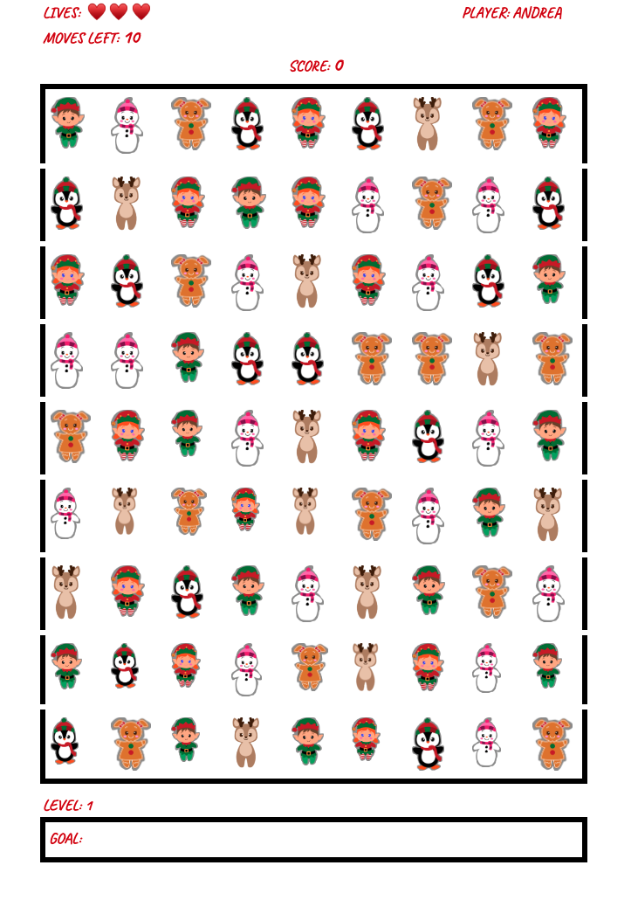

# **XmasClash**

## **Background:**

XmasClash is a single-player image-matching game, where a player should complete each level by swapping the Christmas images on a 9 by 9 game board. In order for a valid match, there need to be three or more consecutive images of the same type. When a match successfully takes place, the images will be eliminated and replaced with new ones. These new images could possibly create more matches. A match of four or more images will generate a Santa Claus image that can be used as a wildcard image. Each level has a goal that must be completed within a preset number of moves and scores. if the player does not successfully complete the level, a life will be lost. If the user runs out of lives at any level, the player will be taken back to level 0. 

## **Functionality & MVPs:**

With XmasClash game, users will be able to:

* Start and reset the board game
* Player will be awarded three lives
* Click and awap imges 
* Get points after each swap 
* Progress from one level to another 

## **Wireframe:**

## **Technologies, Libraries, APIs**

In this project the following technologies will be implemented: 

* CSS for layout and styling
* The Canvas API to render the game board
* HTML for component or element structuring
* Webpack to bundle and transpile the source JavaScript code
* JavaScript for logic handling 
* npm to manage project dependencies

## **Timeline:**

**Friday Afternoon & Weekend:** Set up the project by creating the structure/skeleton of the files. Install all necessary packages and make sure they all compile successfully. Creating HTML elements or components and making sure the board, cells, and background render successfully. Create Board and Cell classes. Implement the logic of swapping.  Have buffer time for debugging. 

**Monday:** Work on creating the logic that would be responsible for generating random images when the game starts, when the player loses and when a successful matching of the images takes place. 

**Tuesday:** Generate a Santa image when there is an image match of four or more images. Create the logic for when a Santa image appears, so it can be used as a wildcard. 

**Wednesday:** Generate the logic to increase points after a match, reduce lives when a player runs out of moves, and decrease moves after a swap. Implement a landing page prior to navigating to the main game page. Generate the logic for showing the different levels. 

**Thursday Morning:** Perform final touches and make any necessary corrections. Deploy to production by pushing to GitHub pages. Write production README.md if there is time left. 

