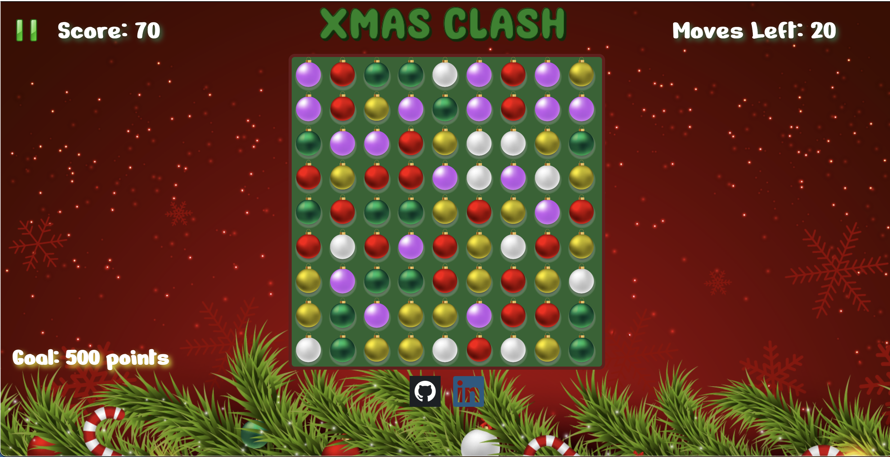

# **XmasClash**

### * Link to live version:

https://andreacanog.github.io/XmasClash/

## **Instructions on how to play:**

XmasClash is a single-player image-matching game, where a player should acheive a certain amount ofpoints by swapping the Christmas ornaments on a 9 by 9 game board. In order for a valid match, there need to be three or more consecutive ornaments of the same color. When a match successfully takes place, the ornaments will be eliminated and replaced with new ones. These new ornaments could possibly create more matches. The goal of the game must be completed within a preset number of moves and scores. If the player does not successfully complete the the game, he will lose.


## **Functionality & MVPs:**

With XmasClash game, users will be able to:

* Start and reset the board game
* Click and awap imges 
* Get points after each swap 


## **Wireframe:**




## **Technologies, Libraries, APIs**

In this project the following technologies will be implemented: 

* CSS for layout and styling
* The DOM to render the game board
* HTML for component or element structuring
* Webpack to bundle and transpile the source JavaScript code
* JavaScript for logic handling 
* npm to manage project dependencies


## **Technical implementation details with code snippets.**


```js 
    dragEnd() {
        this.updatedByUser = true; 
        if (currentBall.src.includes("blank") || otherBall.src.includes("blank")) { 
            return; 
        }

        let currentCoords = currentBall.id.split("-");
        let row1 = parseInt(currentCoords[0]);  
        let column1 = parseInt(currentCoords[1]);


        let otherCoords = otherBall.id.split("-");
        let row2 = parseInt(otherCoords[0]); 
        let column2 = parseInt(otherCoords[1]);

        let movLeft = column2 === (column1 - 1) && row1 === row2
        let movRight = column2 === (column1 + 1) && row1 === row2
        let movUp = row2 === (row1 - 1) && column2 === column1
        let movDown = row2 === (row1 + 1) && column2 === column1

        let allowMov = movLeft || movUp || movDown || movRight

        if (allowMov) {

            let currentImg = currentBall.src; 
            let otherImg = otherBall.src;
        
    
            currentBall.src = otherImg;
            otherBall.src = currentImg;
            let valid1 = this.validMoveForThree();
            let valid2 = this.validMoveForFour();
            let valid3 = this.validMoveForFive();
            

            if (!valid3 && !valid2 && !valid1) {
                let currentImg = currentBall.src; 
                let otherImg = otherBall.src;
            
                currentBall.src = otherImg;
                otherBall.src = currentImg;
                this.movements += 1;
            }
            
        
            if (this.updatedByUser) {
                this.movements -= 1;
                
            }
        } 
        this.updatedByUser = false; 
       
    }
```


### **Future Features/ To do:**

XmasClash is a single-player image-matching game, where a player should complete each level by swapping the Christmas ornaments on a 9 by 9 game board. A match of four or more images will generate a Santa Claus image that can be used as a wildcard image. Each level has a goal that must be completed within a preset number of moves and scores. If the player does not successfully complete the level, a life will be lost. If the user runs out of lives at any level, the player will be taken back to level 1. 

* Game will have different levels
* Player will be awarded three lives
* Progress from one level to another 